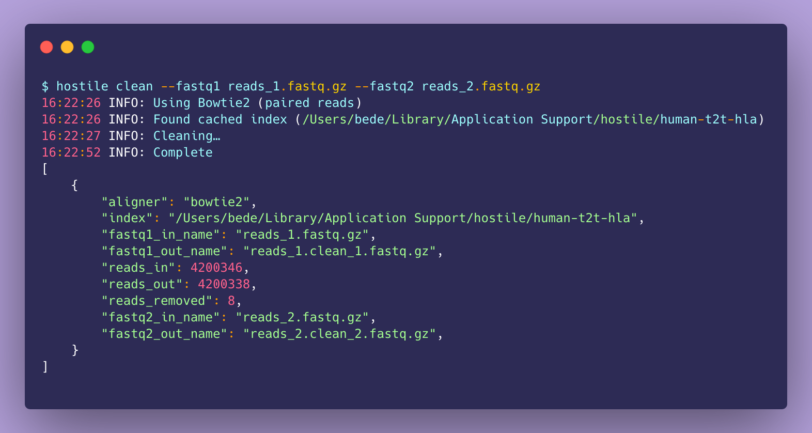

[](https://github.com/bede/hostile/actions/workflows/test.yml) [](https://pypi.org/project/hostile/) [](https://anaconda.org/bioconda/hostile/) [](https://anaconda.org/bioconda/hostile) [](https://doi.org/10.1093/bioinformatics/btad728)

<p align="center">
    
</p>

# Hostile

Hostile accurately removes host sequences from short and long reads, consuming paired or unpaired `fastq[.gz]` input. Batteries are included – a human reference genome is downloaded when run for the first time. Hostile is precise by default, removing an [order of magnitude fewer microbial reads](https://log.bede.im/2023/08/29/precise-host-read-removal.html#evaluating-accuracy) than existing approaches while removing >99.5% of real human reads from 1000 Genomes Project samples. For the best possible retention of microbial reads, one can use a reference masked against bacterial and/or viral genomes, or make your own using the built-in masking utility. Read headers can be replaced with integers (using `--rename`) for privacy and smaller FASTQs. Heavy lifting is done with fast existing tools (Minimap2/Bowtie2 and Samtools). Bowtie2 is the default aligner for short (paired) reads while Minimap2 is default aligner for long reads. In benchmarks, bacterial Illumina reads were decontaminated at 32Mbp/s (210k reads/sec) and bacterial ONT reads at 22Mbp/s, using 8 alignment threads. Further information and benchmarks can be found in the [paper](https://doi.org/10.1093/bioinformatics/btad728) and [blog post](https://log.bede.im/2023/08/29/precise-host-read-removal.html). Please open an issue to report problems [or](mailto:b@bede.im) [otherwise](https://twitter.com/beconsta) [reach](https://bsky.app/profile/bedec.bsky.social) [out](https://mstdn.science/@bede) for help, advice etc.


## Reference genomes (indexes)

The default index `human-t2t-hla` comprises [T2T-CHM13v2.0](https://www.ncbi.nlm.nih.gov/assembly/11828891) and [IPD-IMGT/HLA](https://www.ebi.ac.uk/ipd/imgt/hla/) v3.51, and is downloaded automatically when running Hostile unless another index is specified. Slightly higher microbial sequence retention is possible using a masked index, of which several are available. The index `human-t2t-hla-argos985` is masked against [985 reference grade bacterial genomes](https://www.ncbi.nlm.nih.gov/bioproject/231221) including common human pathogens, while `human-t2t-hla-argos985-mycob140` is further masked against mycobacterial genomes. To use a standard index, simply pass its name as the value of the `--index` argument which takes care of downloading and cacheing the relevant index. Automatic download can be disabled using the `--offline` flag, and `--index` can accept a path to a custom reference genome or Bowtie2 index. [Object storage](https://objectstorage.uk-london-1.oraclecloud.com/n/lrbvkel2wjot/b/human-genome-bucket/o) is provided by the [ModMedMicro research group](https://www.expmedndm.ox.ac.uk/modernising-medical-microbiology).

|               Name                |                         Composition                          | Date    |
| :-------------------------------: | :----------------------------------------------------------: | ------- |
|   `human-t2t-hla` **(default)**   | [T2T-CHM13v2.0](https://www.ncbi.nlm.nih.gov/assembly/11828891) + [IPD-IMGT/HLA](https://www.ebi.ac.uk/ipd/imgt/hla/) v3.51 | 2023-07 |
|     `human-t2t-hla-argos985`      | [T2T-CHM13v2.0](https://www.ncbi.nlm.nih.gov/assembly/11828891) & [IPD-IMGT/HLA](https://www.ebi.ac.uk/ipd/imgt/hla/) v3.51; masked with [985](https://github.com/bede/hostile/blob/main/paper/supplementary-table-2.tsv) [FDA-ARGOS](https://www.ncbi.nlm.nih.gov/bioproject/231221) 150mers | 2023-07 |
| `human-t2t-hla-argos985-mycob140` | [T2T-CHM13v2.0](https://www.ncbi.nlm.nih.gov/assembly/11828891) & [IPD-IMGT/HLA](https://www.ebi.ac.uk/ipd/imgt/hla/) v3.51; masked with [985](https://github.com/bede/hostile/blob/main/paper/supplementary-table-2.tsv) [FDA-ARGOS](https://www.ncbi.nlm.nih.gov/bioproject/231221) & [140](https://github.com/bede/hostile/blob/main/paper/supplementary-table-2.tsv) mycobacterial 150mers | 2023-07 |

*Performance of `human-t2t-hla` and `human-t2t-hla-argos985-mycob140` was evaluated in the [paper](https://www.biorxiv.org/content/10.1101/2023.07.04.547735)*

## Install  [](https://biocontainers.pro/tools/hostile) [](https://biocontainers.pro/tools/hostile)

Installation with conda/mamba or Docker is recommended due to non-Python dependencies (Bowtie2, Minimap2, Samtools and Bedtools). Hostile is tested with Ubuntu Linux 22.04, MacOS 12, and under WSL for Windows.

**Conda/mamba**

```bash
conda create -y -n hostile -c conda-forge -c bioconda hostile
conda activate hostile
```

**Docker**

```bash
docker run quay.io/biocontainers/hostile:0.2.0--pyhdfd78af_0

# Build your own
wget https://raw.githubusercontent.com/bede/hostile/main/Dockerfile
docker build . --platform linux/amd64
```

**Development install**

```bash
git clone https://github.com/bede/hostile.git
cd hostile
conda env create -y -f environment.yml
conda activate hostile
pip install --editable '.[dev]'
pytest
```


## Index installation

Hostile automatically downloads and caches the default index `human-t2t-hla` when run for the first time. To download indexes without running `hostile clean`, run

- To force Hostile to download the default index (`human-t2t-hla`), run `hostile fetch`
- To show a list of available genomes, run `hostile fetch --list`
- To download a non-default genome, run e.g.
  `hostile fetch --name human-t2t-hla-argos985`
- To use a custom genome, run `hostile clean --index path/to/genome.fa`


## Command line usage



```bash
$ hostile clean --help
usage: hostile clean [-h] --fastq1 FASTQ1 [--fastq2 FASTQ2] [--aligner {bowtie2,minimap2,auto}] [--index INDEX] [--rename] [--reorder] [--out-dir OUT_DIR]
                     [--threads THREADS] [--aligner-args ALIGNER_ARGS] [--force] [--debug]

Remove reads aligning to a target genome from fastq[.gz] input files

options:
  -h, --help            show this help message and exit
  --fastq1 FASTQ1       path to forward fastq.gz] file
  --fastq2 FASTQ2       optional path to reverse fastq[.gz] file
                        (default: None)
  --aligner {bowtie2,minimap2,auto}
                        alignment algorithm. Use Bowtie2 for short reads and Minimap2 for long reads
                        (default: auto)
  --index INDEX         path to custom genome or index. For Bowtie2, exclude the .1.bt2 suffix
                        (default: None)
  --rename              replace read names with incrementing integers
                        (default: False)
  --reorder             ensure deterministic output order
                        (default: False)
  --out-dir OUT_DIR     path to output directory
                        (default: /Users/bede/Research/Git/hostile)
  --threads THREADS     number of alignment threads. A sensible default is chosen automatically
                        (default: 5)
  --aligner-args ALIGNER_ARGS
                        additional arguments for alignment
                        (default: )
  --force               overwrite existing output files
                        (default: False)
  --debug               show debug messages
                        (default: False)
```


**Short reads**

```bash
$ hostile clean --fastq1 reads.r1.fastq.gz --fastq2 reads.r2.fastq.gz
INFO: Using Bowtie2 (paired reads)
INFO: Found cached index (/Users/bede/Library/Application Support/hostile/human-t2t-hla)
INFO: Cleaning…
INFO: Complete
[
    {
        "aligner": "bowtie2",
        "index": "/path/to/data/dir/human-t2t-hla",
        "fastq1_in_name": "reads.r1.fastq.gz",
        "fastq2_in_name": "reads.r2.fastq.gz",
        "fastq1_in_path": "/path/to/hostile/reads.r1.fastq.gz",
        "fastq2_in_path": "/path/to/hostile/reads.r2.fastq.gz",
        "fastq1_out_name": "reads.r1.clean_1.fastq.gz",
        "fastq2_out_name": "reads.r2.clean_2.fastq.gz",
        "fastq1_out_path": "/path/to/hostile/reads.r1.clean_1.fastq.gz",
        "fastq2_out_path": "/path/to/hostile/reads.r2.clean_2.fastq.gz",
        "reads_in": 20,
        "reads_out": 20,
        "reads_removed": 0,
        "reads_removed_proportion": 0.0
    }
]
```

```bash
$ hostile clean --rename --fastq1 reads_1.fastq.gz --fastq2 reads_2.fastq.gz \
  --index /path/to/human-t2t-hla-argos985-mycob140 > decontamination-log.json
INFO: Using Bowtie2
INFO: Found cached index (/Users/bede/Library/Application Support/hostile/human-t2t-hla)
INFO: Cleaning…
INFO: Complete
```


**Long reads**

```bash
$ hostile clean --fastq1 tests/data/h37rv_10.r1.fastq.gz
INFO: Using Minimap2's long read preset (map-ont)
INFO: Found cached genome (/Users/bede/Library/Application Support/hostile/human-t2t-hla)
INFO: Cleaning…
INFO: Complete
[
    {
        "aligner": "minimap2",
        "index": "/Users/bede/Library/Application Support/hostile/human-t2t-hla.fa.gz",
        "fastq1_in_name": "reads.fastq.gz",
        "fastq1_in_path": "/path/to/hostile/reads.fastq.gz",
        "fastq1_out_name": "reads.clean.fastq.gz",
        "fastq1_out_path": "/path/to/hostile/reads.clean.fastq.gz",
        "reads_in": 10,
        "reads_out": 10,
        "reads_removed": 0,
        "reads_removed_proportion": 0.0
    }
]
```


## Python usage

```python
from pathlib import Path
from hostile.lib import clean_fastqs, clean_paired_fastqs

# Long reads, defaults
clean_fastqs(
    fastqs=[Path("reads.fastq.gz")],
)

# Paired short reads, various options, capture log
log = clean_paired_fastqs(
    fastqs=[(Path("reads_1.fastq.gz"), Path("reads_2.fastq.gz"))],
    index=Path("reference.fasta.gz"),
    out_dir=Path("decontaminated-reads"),
  	rename=True,
    force=True,
    threads=4
)

print(log)
```


## Masking reference genomes

The `mask` subcommand makes it easy to create custom-masked reference genomes and achieve maximum retention of specific target organisms:
```bash
hostile mask human.fasta lots-of-bacterial-genomes.fasta --threads 8
```
You may wish to use one of the existing [reference genomes](##reference-genomes--indexes) as a starting point. Masking uses Minimap2's `asm10` preset to align the supplied target genomes with the reference genome, and bedtools to mask out all aligned regions. For Bowtie2—the default aligner for decontaminating short reads—you will also need to build an index before you can use your masked genome with Hostile.

```bash
bowtie2-build masked.fasta masked-index
hostile clean --index masked-index --fastq1 reads_1.fastq.gz --fastq2 reads_2.fastq.gz
```


## Known issues

- Use of more than 10 alignment threads may reduce performance, even on systems with enough CPU cores. Hostile `0.4.0` automatically selects a suitable number of alignment threads based on the number of available cores, approximately equal to `min(cpu_count/2, 10)`.
- Minimap2 has an overhead of 30-90s for human genome indexing prior to starting decontamination. Surprisingly, loading a prebuilt index is not significantly faster. I hope to mitigate this in a future release.


## Citation

Bede Constantinides, Martin Hunt, Derrick W Crook,  Hostile: accurate decontamination of microbial host sequences, *Bioinformatics*, 2023; btad728, https://doi.org/10.1093/bioinformatics/btad728

```latex
@article{Constantinides2023,
    author = {Constantinides, Bede and Hunt, Martin and Crook, Derrick W},
    title = {Hostile: accurate decontamination of microbial host sequences},
    journal = {Bioinformatics},
    pages = {btad728},
    year = {2023},
    month = {12},
    issn = {1367-4811},
    doi = {10.1093/bioinformatics/btad728},
    url = {https://doi.org/10.1093/bioinformatics/btad728},
    eprint = {https://academic.oup.com/bioinformatics/advance-article-pdf/doi/10.1093/bioinformatics/btad728/53970806/btad728.pdf},
}
```
